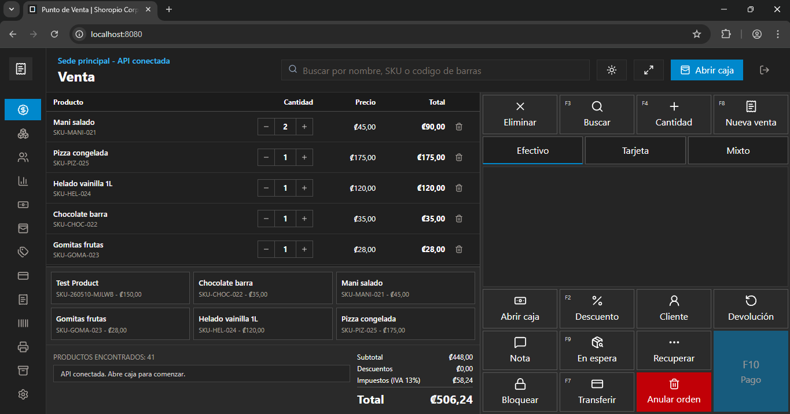

<div align="center">



# 🚀 POS Profesional
### *Sistema de punto de venta con frontend React + TypeScript y backend Laravel + Sanctum.*

[](https://react.dev)
[](https://www.typescriptlang.org)
[](https://vite.dev)
[](https://tailwindcss.com)
[](https://zustand-demo.pmnd.rs)
[](https://tanstack.com/query)
[](https://laravel.com)
[](https://laravel.com/docs/sanctum)
[](https://php.net)
[](https://www.mysql.com)
[](https://nginx.org)
[](https://www.docker.com/)
[](LICENSE)

[Explorar el sitio](https://shoropio.com) · [Reportar Bug](https://shoropio.com/contactenos) · [Solicitar Feature](https://shoropio.com/contactenos)

</div>

## Modulos

| Modulo | Descripcion |
|---|---|
| **Venta** | Punto de venta con busqueda de productos, carrito, pagos mixtos y recibos |
| **Inventario** | CRUD de productos, ajustes de stock, valor de inventario |
| **Clientes** | Registro, historial de compras, creditos y cuentas por cobrar |
| **Caja** | Sesiones de caja, depositos y retiros |
| **Creditos** | Seguimiento de creditos y abonos de clientes |
| **Promociones** | Codigos de descuento y promociones activas |
| **Formas de pago** | Configuracion de medios de pago (efectivo, tarjeta, transferencia, credito) |
| **Facturacion** | Generacion de facturas fiscales v4.4 vinculadas a ventas, envio a Hacienda |
| **Codigos de barras** | Generacion y asignacion de codigos a productos |
| **Impresora** | Configuracion de impresion de tickets |
| **Respaldos** | Respaldos manuales/programados, Firestore, verificacion, descarga y restauracion |
| **Reportes** | Resumen de ventas, productos mas vendidos, historial e inventario |
| **Configuracion** | Datos del negocio, moneda, impuestos, WhatsApp, catalogos y sucursales |
| **Contabilidad** | Plan de cuentas CR, asientos contables, balance de comprobacion, bancos |
| **RRHH** | Empleados, registro de asistencia (clock-in/out con PIN) |
| **Facturito AI** | Asistente de IA (Gemini 2.0 Flash Lite) para consultas del POS |
| **E-commerce** | Sincronizacion con WooCommerce, Shopify y Mercado Libre |
| **WhatsApp** | Envio de facturas por WhatsApp (Meta Cloud API + Baileys Gateway) |

## Stack

- **Frontend:** React 19, Vite, TypeScript, Tailwind CSS v4, Zustand, React Query
- **Backend:** Laravel 13, Sanctum, DomPDF, barryvdh/laravel-dompdf
- **Base de datos:** MySQL 8.4 (soporta PostgreSQL)
- **Docker:** Docker Compose con MySQL, backend, scheduler y frontend
- **IA:** Google Gemini 2.0 Flash Lite (Facturito)
- **Nube:** Google Cloud Firestore (respaldos), Google OAuth (autenticacion)
- **E-commerce:** WooCommerce REST API, Shopify Admin API, Mercado Libre API
- **WhatsApp:** Meta Cloud API + Baileys Gateway (dual driver)

## Requisitos

- PHP 8.4+
- Composer
- Node.js 24+
- npm
- MySQL, PostgreSQL o SQLite para desarrollo local

## Variables de entorno

El backend requiere las siguientes variables en `.env`:

```env
# Google Gemini AI (Facturito)
GEMINI_API_KEY=

# Firestore / Firebase (respaldos en la nube)
FIRESTORE_PROJECT_ID=
FIRESTORE_API_KEY=

# Google OAuth (sign-in)
GOOGLE_CLIENT_ID=
GOOGLE_CLIENT_SECRET=

# WhatsApp Meta Cloud API
META_WA_PHONE_NUMBER_ID=
META_WA_ACCESS_TOKEN=

# WhatsApp Baileys Gateway
BAILEYS_ENDPOINT=http://localhost:3001

# WooCommerce
WOO_URL=
WOO_KEY=
WOO_SECRET=

# Shopify
SHOPIFY_URL=
SHOPIFY_TOKEN=

# Mercado Libre
ML_ACCESS_TOKEN=
ML_SITE_ID=MCR
```

## Levantar en desarrollo

Desde PowerShell:

```powershell
git clone https://github.com/Shoropio/punto-de-venta.git
```

```powershell
cd punto-de-venta
```

Backend:

```powershell
cd backend
php artisan serve --host=127.0.0.1 --port=8000
```

Frontend, en otra terminal:

```powershell
cd frontend
npm run dev -- --host 127.0.0.1 --port 5173
```

Abrir la app:

```txt
http://127.0.0.1:5173
```

## Credenciales iniciales

```txt
Correo electrónico: admin@example.com
Contraseña: password
```

## Reiniciar base de datos

Si necesitas recrear la base con datos iniciales:

```powershell
cd backend
php artisan migrate:fresh --seed
```

## Verificacion

Backend:

```powershell
cd backend
php artisan test
```

Frontend:

```powershell
cd frontend
npm run build
```

## Docker

Tambien puedes levantar la pila con Docker:

Primera vez, o cuando cambien `Dockerfile`, dependencias o configuracion de Docker:

```powershell
cd punto-de-venta
docker compose up --build
```

Despues, para levantar los servicios normalmente:

```powershell
docker compose up
```

Si solo cambiaste el frontend y quieres reconstruir ese contenedor en segundo plano:

```powershell
docker compose up -d --build frontend
```

Los respaldos programados los ejecuta el servicio `scheduler` usando la configuracion guardada en el modulo **Respaldos**. El archivo `.zip` queda en el volumen `backup_data`, compartido con el backend para descargar, verificar, restaurar o eliminar respaldos desde la app.

Para forzar manualmente una ejecucion del programador:

```powershell
docker compose exec backend php artisan backups:run-scheduled
```

Ejecutar migraciones y seeders solo la primera vez que creas la base de datos:

```powershell
docker compose exec backend php artisan migrate --seed
```

Luego no hace falta repetirlo en cada arranque. Solo vuelve a ejecutar migraciones si agregaste cambios a la base de datos o si hay migraciones pendientes:

```powershell
docker compose exec backend php artisan migrate
```

Servicios:

- Frontend: `http://localhost:8080`
- Backend API: `http://localhost:8000/api`
- MySQL: `localhost:3307`
- Scheduler: servicio interno de Docker para tareas programadas

## Documentacion tecnica

La arquitectura general esta en:

[Arquitectura general](./docs/ARCHITECTURE.md)

---

## Licencia

© 2026 Shoropio Corporation. Todos los derechos reservados.
