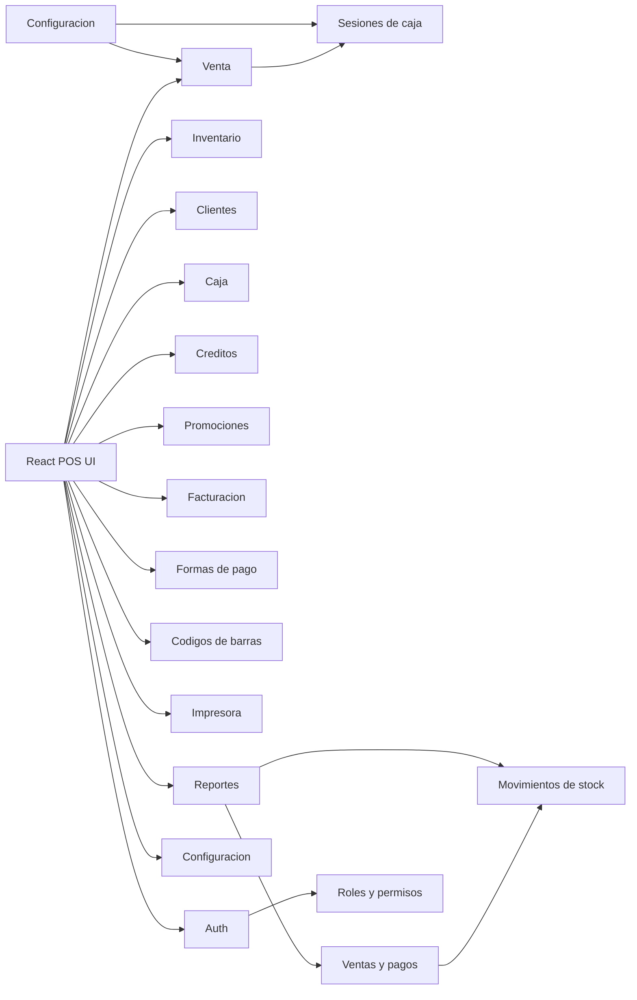

# POS profesional

Sistema de punto de venta con frontend React + TypeScript y backend Laravel + Sanctum.

## 1. Arquitectura general

- Frontend: React 19 + Vite + TypeScript, Tailwind CSS v4, componentes estilo shadcn/ui, Zustand para estado del carrito/caja, React Query para manejo de datos.
- Backend: Laravel 13, REST API, Sanctum para autenticacion por tokens.
- Persistencia: MySQL 8.4 via Docker Compose, con soporte de migrar a PostgreSQL via PDO.
- Dominio: venta, caja, inventario, catalogos, clientes, creditos, promociones, facturacion, formas de pago, codigos de barras, reportes, configuracion, auditoria.
- Offline parcial: el frontend mantiene carrito y catalogo cacheable como siguiente fase; la API queda como fuente de verdad para ventas confirmadas.
- Impresion: modulo de configuracion de impresora implementado; tickets ESC/POS como fase futura.

## 2. Diagrama de modulos

## 3. Esquema de base de datos

Tablas implementadas (27 migraciones):

- `users`: usuarios con `role_id`, `branch_id`, estado activo y credenciales.
- `roles`, `permissions`, `permission_role`: RBAC base para admin, gerente y cajero.
- `branches`, `cash_registers`, `cash_sessions`: sucursales, cajas fisicas y turnos de caja.
- `categories`, `brands`, `suppliers`, `products`: catalogo e inventario.
- `customers`: datos, credito (balance), saldo y puntos de lealtad.
- `sales`, `sale_items`, `payments`: ticket, lineas de venta y pagos multiples.
- `stock_movements`: entradas, salidas, ajustes, ventas y devoluciones.
- `refunds`: devoluciones aprobadas o rechazadas.
- `settings`: configuracion global o por sucursal.
- `activity_logs`: auditoria de acciones relevantes.
- `cash_movements`: deposits y retiros de caja.
- `payment_methods`: formas de pago configurables (efectivo, tarjeta, transferencia, credito, mixto).
- `promotions`: codigos de descuento y promociones activas.
- `invoices`: facturas fiscales vinculadas a ventas.
- `credit_payments`: abonos a cuentas por cobrar de clientes.

## 4. Endpoints REST principales

### Autenticacion
- `POST /api/auth/login`, `POST /api/auth/logout`, `GET /api/user`

### Productos
- `GET|POST /api/products`, `GET|PUT|DELETE /api/products/{id}`
- `GET /api/barcodes/generate`, `POST /api/products/{id}/barcode`

### Catalogos
- `GET|POST /api/categories`, `GET|POST /api/brands`, `GET|POST /api/suppliers`, `GET|POST /api/customers`, `GET|POST /api/branches`

### Formas de pago
- `GET|POST /api/payment-methods`, `PUT /api/payment-methods/{id}`

### Caja
- `POST /api/cash-sessions/open`, `GET /api/cash-sessions/current`, `POST /api/cash-sessions/{id}/close`
- `GET|POST /api/cash-movements`

### Ventas
- `GET|POST /api/sales`, `GET /api/sales/{id}`, `POST /api/sales/{id}/cancel`

### Creditos
- `GET|POST /api/credit-payments`

### Promociones
- `GET|POST /api/promotions`

### Facturacion
- `GET|POST /api/invoices`

### Devoluciones
- `GET|POST /api/refunds`

### Inventario
- `GET|POST /api/stock-movements`

### Configuracion
- `GET|POST /api/settings`

### Reportes
- `GET /api/reports/sales-summary`, `GET /api/reports/top-products`, `GET /api/reports/inventory`

## 5. Estructura de carpetas

Backend:

- `app/Http/Controllers/Api`: 15 controladores REST (auth, productos, catalogos, caja, ventas, creditos, promociones, facturacion, devoluciones, inventario, configuracion, reportes, formas de pago, codigos de barras).
- `app/Http/Requests`: validacion con Form Requests.
- `app/Http/Resources`: serializacion de respuestas.
- `app/Services`: logica transaccional de ventas (`SaleService`) e inventario (`StockService`).
- `app/Models`: 23 entidades Eloquent.
- `database/migrations`: 27 migraciones.
- `database/seeders`: roles, permisos, sucursal, caja, usuario admin y datos iniciales.
- `tests/Feature`: 6 pruebas (auth, inventario, ventas, devoluciones, modulos operacionales).

Frontend:

- `src/components/ui`: componentes base estilo shadcn (button, card, input).
- `src/components/shared`: componentes reutilizables (CatalogCard, DataCard, Empty, Metric, ModuleStatusBar, PrintableReceipt, SelectBox, StatusTile, Toast).
- `src/components/pos`: componentes especificos del POS (PosAction).
- `src/modules`: 12 modulos operativos (sale, inventory, customers, reports, cash, credit, promotions, payments, invoices, barcodes, printer, settings).
- `src/store`: Zustand store del POS (carrito, metodo de pago, sesion de caja) con tests unitarios.
- `src/types`: definiciones TypeScript tipadas para todas las entidades.
- `src/lib`: utilidades (api client, currency formatter, helpers POS) con tests unitarios.

## 6. Plan por fases

1. ~~Base tecnica: scaffold Laravel/React, Docker, Sanctum, migraciones, seeders y tests.~~ ✅
2. ~~POS funcional: ventas, carrito persistente, pagos mixtos, caja, recibos y devoluciones.~~ ✅
3. ~~Inventario: CRUD de productos, ajustes de stock, valor de inventario.~~ ✅
4. ~~Catalogos: categorias, marcas, proveedores, sucursales.~~ ✅
5. ~~Clientes: registro, historial, credito y cuentas por cobrar.~~ ✅
6. ~~Caja: sesiones, movimientos (depositos/retiros).~~ ✅
7. ~~Formas de pago configurables.~~ ✅
8. ~~Promociones y codigos de descuento.~~ ✅
9. ~~Facturacion fiscal vinculada a ventas.~~ ✅
10. ~~Codigos de barras: generacion y asignacion.~~ ✅
11. ~~Reportes: resumen de ventas, productos top, inventario.~~ ✅
12. ~~Configuracion e impresion.~~ ✅
13. Inventario avanzado: compras, transferencias, conteos fisicos, alertas de stock minimo, kardex.
14. Reportes avanzados: dashboards, filtros por fecha/sucursal, exportacion PDF/Excel.
15. Offline parcial: cache de catalogo, cola local de ventas pendientes, resolucion de conflictos.
16. Seguridad y auditoria: permisos finos, activity logs completos, backups automatizados.
17. Impresion ESC/POS: tickets desde servicio backend o agente local.
18. Produccion: Nginx/PHP-FPM, colas, scheduler, monitoreo y CI/CD.
