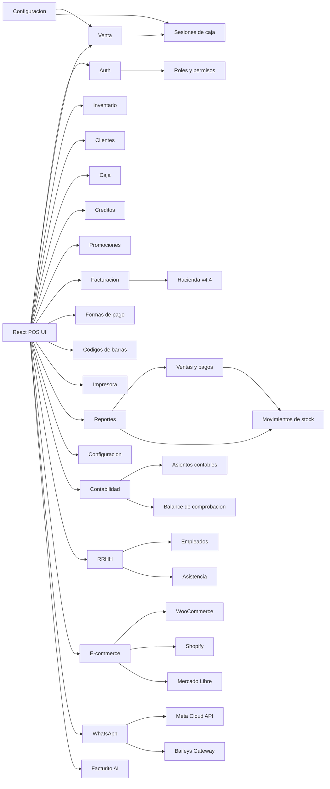

# POS profesional

Sistema de punto de venta con frontend React + TypeScript y backend Laravel + Sanctum.

## 1. Arquitectura general

- Frontend: React 19 + Vite + TypeScript, Tailwind CSS v4, componentes estilo shadcn/ui, Zustand para estado del carrito/caja, React Query para manejo de datos.
- Backend: Laravel 13, REST API, Sanctum para autenticacion por tokens, barryvdh/laravel-dompdf para PDFs.
- Persistencia: MySQL 8.4 via Docker Compose, con soporte de migrar a PostgreSQL via PDO.
- Dominio: venta, caja, inventario, catalogos, clientes, creditos, promociones, facturacion, formas de pago, codigos de barras, reportes, configuracion, auditoria, contabilidad, RRHH, e-commerce, WhatsApp.
- Offline parcial: el frontend mantiene carrito y catalogo cacheable como siguiente fase; la API queda como fuente de verdad para ventas confirmadas.
- Impresion: PDF con DomPDF, tickets ESC/POS como fase futura.
- Facturacion electronica: Hacienda Costa Rica v4.4 completa (XML, firma XMLDSig, envio/recepcion, consulta de estado).
- WhatsApp: envio de facturas via Meta Cloud API y Baileys Gateway (dual driver).
- E-commerce: sincronizacion bidireccional con WooCommerce, Shopify y Mercado Libre.
- IA: Google Gemini 2.0 Flash Lite (Facturito) para consultas del POS.
- Nube: Google Cloud Firestore para respaldos.

## 2. Diagrama de modulos

## 3. Esquema de base de datos

Tablas implementadas (30+ migraciones):

- `users`: usuarios con `role_id`, `branch_id`, estado activo y credenciales.
- `roles`, `permissions`, `permission_role`: RBAC base (admin, gerente, cajero, contador, rrhh).
- `branches`, `cash_registers`, `cash_sessions`: sucursales, cajas fisicas y turnos de caja.
- `categories`, `brands`, `suppliers`, `products`: catalogo e inventario.
- `customers`: datos, credito (balance), saldo y puntos de lealtad.
- `sales`, `sale_items`, `payments`: ticket, lineas de venta y pagos multiples.
- `stock_movements`: entradas, salidas, ajustes, ventas y devoluciones.
- `refunds`: devoluciones aprobadas o rechazadas.
- `settings`: configuracion global o por sucursal.
- `activity_logs`: auditoria de acciones relevantes.
- `cash_movements`: deposits y retiros de caja.
- `payment_methods`: formas de pago configurables (efectivo, tarjeta, transferencia, credito, mixto).
- `promotions`: codigos de descuento y promociones activas.
- `invoices`: facturas fiscales vinculadas a ventas, estado Hacienda, rutas XML.
- `credit_payments`: abonos a cuentas por cobrar de clientes.
- `hacienda_settings`: configuracion fiscal por sucursal (ambiente, identificacion, certificados).
- `accounting_accounts`: plan de cuentas Costa Rica (50 cuentas estandar).
- `accounting_entries`, `accounting_items`: asientos contables de doble partida.
- `bank_accounts`: cuentas bancarias vinculadas al plan de cuentas.
- `employees`: datos de empleados, PIN para asistencia.
- `attendances`: registros de entrada/salida.
- `whatsapp_settings`: configuracion del driver WhatsApp (Meta/Baileys).

## 4. Endpoints REST principales

### Autenticacion
- `POST /api/auth/login`, `POST /api/auth/logout`, `GET /api/user`

### Productos
- `GET|POST /api/products`, `GET|PUT|DELETE /api/products/{id}`
- `GET /api/barcodes/generate`, `POST /api/products/{id}/barcode`

### Catalogos
- `GET|POST /api/categories`, `GET|POST /api/brands`, `GET|POST /api/suppliers`, `GET|POST /api/customers`, `GET|POST /api/branches`

### Formas de pago
- `GET|POST /api/payment-methods`, `PUT /api/payment-methods/{id}`

### Caja
- `POST /api/cash-sessions/open`, `GET /api/cash-sessions/current`, `POST /api/cash-sessions/{id}/close`
- `GET|POST /api/cash-movements`

### Ventas
- `GET|POST /api/sales`, `GET /api/sales/{id}`, `POST /api/sales/{id}/cancel`

### Creditos
- `GET|POST /api/credit-payments`

### Promociones
- `GET|POST /api/promotions`

### Facturacion
- `GET|POST /api/invoices`
- `POST /api/invoices/{invoice}/xml`, `POST /api/invoices/{invoice}/sign`
- `POST /api/invoices/{invoice}/submit`, `POST /api/invoices/{invoice}/status`

### Devoluciones
- `GET|POST /api/refunds`

### Inventario
- `GET|POST /api/stock-movements`

### Configuracion
- `GET|POST /api/settings`
- `GET|POST /api/hacienda-settings`

### Reportes
- `GET /api/reports/sales-summary`, `GET /api/reports/top-products`, `GET /api/reports/inventory`

### Contabilidad
- `GET|POST /api/accounting/accounts`, `GET|POST /api/accounting/entries`
- `GET /api/accounting/trial-balance`, `GET|POST /api/accounting/bank-accounts`

### RRHH
- `GET|POST /api/hr/employees`, `POST /api/hr/attendance/clock`

### WhatsApp
- `GET|POST /api/whatsapp/settings`, `POST /api/whatsapp/send-invoice`

### E-commerce
- `POST /api/ecommerce/push/{product}`, `GET /api/ecommerce/pull/{platform}`

## 5. Estructura de carpetas

Backend:

- `app/Http/Controllers/Api`: 19 controladores REST.
- `app/Http/Requests`: validacion con Form Requests.
- `app/Services`: logica transaccional de ventas (`SaleService`), inventario (`StockService`), contabilidad (`DoubleEntryService`), PDF (`PdfService`), WhatsApp (`WhatsAppService`), IA (`GeminiService`), respaldos (`FirestoreBackupService`), e-commerce (`EcommerceSyncService`).
- `app/Observers`: `SaleObserver` para asientos contables automaticos.
- `app/Models`: 25+ entidades Eloquent.
- `database/migrations`: 30+ migraciones.
- `database/seeders`: roles, permisos, catalogo contable CR (50 cuentas), datos iniciales.
- `tests/Feature`: 30 pruebas, 266 aserciones.

Frontend:

- `src/components/ui`: componentes base estilo shadcn (button, card, input).
- `src/components/shared`: componentes reutilizables (CatalogCard, DataCard, Empty, FacturitoChat, Metric, ModuleStatusBar, PrintableReceipt, SelectBox, StatusTile, Toast, WhatsAppConfig).
- `src/components/pos`: componentes especificos del POS (PosAction).
- `src/modules`: 14 modulos operativos (sale, inventory, customers, reports, cash, credit, promotions, payments, invoices, barcodes, printer, settings, accounting, hr).
- `src/store`: Zustand store del POS (carrito, metodo de pago, sesion de caja) con tests unitarios.
- `src/types`: definiciones TypeScript tipadas para todas las entidades.
- `src/lib`: utilidades (api client, currency formatter, helpers POS) con tests unitarios.

## 6. Plan por fases

1. ~~Base tecnica: scaffold Laravel/React, Docker, Sanctum, migraciones, seeders y tests.~~ ✅
2. ~~POS funcional: ventas, carrito persistente, pagos mixtos, caja, recibos y devoluciones.~~ ✅
3. ~~Inventario: CRUD de productos, ajustes de stock, valor de inventario.~~ ✅
4. ~~Catalogos: categorias, marcas, proveedores, sucursales.~~ ✅
5. ~~Clientes: registro, historial, credito y cuentas por cobrar.~~ ✅
6. ~~Caja: sesiones, movimientos (depositos/retiros).~~ ✅
7. ~~Formas de pago configurables.~~ ✅
8. ~~Promociones y codigos de descuento.~~ ✅
9. ~~Facturacion fiscal v4.4 vinculada a ventas, envio a Hacienda.~~ ✅
10. ~~Codigos de barras: generacion y asignacion.~~ ✅
11. ~~Reportes: resumen de ventas, productos top, inventario.~~ ✅
12. ~~Configuracion e impresion.~~ ✅
13. ~~Contabilidad: plan de cuentas CR, asientos doble partida, balance de comprobacion.~~ ✅
14. ~~RRHH: empleados, asistencia con clock-in/out y PIN.~~ ✅
15. ~~WhatsApp: envio de facturas (Meta Cloud API + Baileys Gateway).~~ ✅
16. ~~E-commerce: sincronizacion WooCommerce, Shopify, Mercado Libre.~~ ✅
17. ~~PDF real con DomPDF.~~ ✅
18. ~~Facturito AI: asistente Gemini para consultas del POS.~~ ✅
19. Inventario avanzado: compras, transferencias, conteos fisicos, alertas de stock minimo, kardex.
20. Reportes avanzados: dashboards, filtros por fecha/sucursal, exportacion PDF/Excel.
21. Offline parcial: cache de catalogo, cola local de ventas pendientes, resolucion de conflictos.
22. Seguridad y auditoria: permisos finos, activity logs completos, backups automatizados.
23. Impresion ESC/POS: tickets desde servicio backend o agente local.
24. Produccion: Nginx/PHP-FPM, colas, scheduler, monitoreo y CI/CD.
