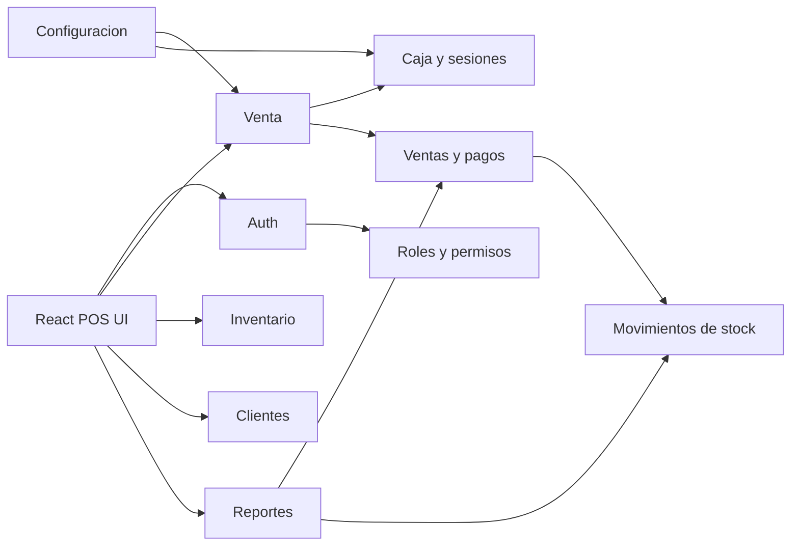

# POS profesional original

Este sistema es una implementacion original inspirada en capacidades comunes de POS modernos. No usa marca, diseno exacto ni codigo de Aronium.

## 1. Arquitectura general

- Frontend: React + Vite + TypeScript, Tailwind CSS, componentes estilo shadcn/ui, Zustand para estado local del carrito/caja.
- Backend: Laravel 13, compatible con el requisito Laravel 11+, REST API, Sanctum para tokens.
- Persistencia: MySQL por Docker Compose, con soporte de migrar a PostgreSQL por PDO.
- Dominio: venta, caja, inventario, catalogos, clientes, reportes, configuracion, auditoria.
- Offline parcial: el frontend mantiene carrito y catalogo cacheable como siguiente fase; la API queda como fuente de verdad para ventas confirmadas.
- Impresion: modulo futuro de tickets ESC/POS desde servicio backend o agente local de impresion.

## 2. Diagrama de modulos

## 3. Esquema de base de datos

Tablas implementadas:

- `users`: usuarios con `role_id`, `branch_id`, estado activo y credenciales.
- `roles`, `permissions`, `permission_role`: RBAC base para admin, gerente y cajero.
- `branches`, `cash_registers`, `cash_sessions`: sucursales, cajas fisicas y turnos.
- `categories`, `brands`, `suppliers`, `products`: catalogo e inventario.
- `customers`: datos, credito, saldo y puntos.
- `sales`, `sale_items`, `payments`: ticket, lineas y pagos multiples.
- `stock_movements`: entradas, salidas, ajustes, ventas y devoluciones.
- `refunds`: devoluciones aprobadas o rechazadas.
- `settings`: configuracion global o por sucursal.
- `activity_logs`: auditoria de acciones relevantes.

## 4. Endpoints REST principales

- `POST /api/auth/login`, `POST /api/auth/logout`, `GET /api/user`
- `GET|POST /api/products`, `GET|PUT|DELETE /api/products/{product}`
- `GET|POST /api/categories`, `GET|POST /api/brands`, `GET|POST /api/suppliers`, `GET|POST /api/customers`
- `POST /api/cash-sessions/open`, `GET /api/cash-sessions/current`, `POST /api/cash-sessions/{cashSession}/close`
- `GET|POST /api/sales`, `GET /api/sales/{sale}`, `POST /api/sales/{sale}/cancel`
- `GET|POST /api/stock-movements`
- `GET /api/reports/sales-summary`, `GET /api/reports/top-products`, `GET /api/reports/inventory`

## 5. Estructura de carpetas

Backend:

- `app/Http/Controllers/Api`: controladores REST.
- `app/Http/Requests`: validacion con Form Requests.
- `app/Http/Resources`: serializacion de respuestas.
- `app/Services`: logica transaccional de ventas e inventario.
- `app/Models`: entidades Eloquent.
- `database/migrations`: esquema relacional.
- `database/seeders`: roles, permisos, sucursal, caja, usuario admin y producto demo.
- `tests/Feature`: pruebas de autenticacion, inventario y venta.

Frontend:

- `src/components/ui`: componentes base estilo shadcn.
- `src/store`: estado Zustand del POS.
- `src/lib`: utilidades y cliente API.
- `src/App.tsx`: primera experiencia operativa del POS.

## 6. Plan por fases

1. Base tecnica: scaffold Laravel/React, Docker, Sanctum, migraciones, seeders y tests.
2. POS funcional: ventas, carrito persistente, pagos mixtos, caja, recibos y devoluciones.
3. Inventario avanzado: compras, proveedores, transferencias, conteos, alertas y kardex.
4. Clientes: historial, credito, cuentas por cobrar, fidelizacion.
5. Reportes: dashboards, filtros, exportacion PDF/Excel.
6. Offline parcial: cache de catalogo, cola local de ventas pendientes, resolucion de conflictos.
7. Seguridad y auditoria: permisos finos, activity logs completos, backups y monitoreo.
8. Produccion: Nginx/PHP-FPM, colas, scheduler, backups automatizados e impresion ESC/POS.
